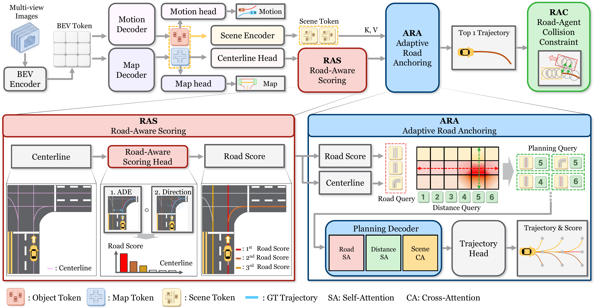

# RoadAnchOR: Road-Adaptive Query Anchoring for End-to-End Autonomous Driving

<p align="center">
  <a href="https://qqqwwweee213313.github.io/RoadAnchOR-Project/?v=2622053"></a>
</p>

<p align="center"><strong>Anonymous Authors</strong></p>
<p align="center">
  <a href="https://qqqwwweee213313.github.io/RoadAnchOR-Project/?v=2622053"></a>
</p>

## Abstract

End-to-end autonomous driving models increasingly rely on query-based frameworks for trajectory generation. However, existing methods face a critical limitation: planning queries are often initialized without explicit geometric priors or depend on rigid, static anchors that fail to adapt to diverse environments. In this paper, we propose RoadAnchOR, a novel road-adaptive planning framework designed to overcome this bottleneck. We introduce Road-Aware Scoring (RAS) to score the planning relevance of online-predicted road geometry and provide an explicit geometric prior. Adaptive Road Anchoring (ARA) uses this prior to initialize planning queries. This mechanism dynamically aligns initial queries with feasible driving paths, ensuring that the trajectory generation process is inherently grounded in the current road structure. We further introduce a collision avoidance constraint based on agent geometry to encourage safer trajectories generated from road geometry. Experiments on Bench2Drive show that RoadAnchOR achieves competitive closed-loop performance compared with state-of-the-art methods, offering a novel planning framework through adaptive query anchoring.

## Architecture

[](docs/assets/architecture.png)

**Figure 2. Overview of the RoadAnchOR architecture.**

RoadAnchOR uses the **VAD architecture for perception**. BEV features from multi-view images feed motion and map decoding branches to provide scene tokens and online-predicted centerlines. The planning framework consists of three components:

| Component | Role |
| --- | --- |
| **Road-Aware Scoring (RAS)** | Scores the planning relevance of predicted centerlines. |
| **Adaptive Road Anchoring (ARA)** | Combines road geometry and distance queries to initialize planning queries, then refines them using scene context to generate trajectories and selection scores. |
| **Road-Agent Collision Constraint (RAC)** | Uses surrounding-agent geometry to provide collision supervision during training. |

RAC is a training loss. The qualitative videos show RoadAnchOR driving scenarios on the project page.

## Code release

This release contains the RoadAnchOR model, its training configuration, the vendored perception library, and training utilities for Bench2Drive. Dataset files, pretrained weights, a closed-loop driving agent, and an evaluation harness are not included. The videos can be viewed directly on the [project page](https://qqqwwweee213313.github.io/RoadAnchOR-Project/#qualitative-videos).

## Getting started

```bash
git clone https://github.com/qqqwwweee213313/RoadAnchOR.git
cd RoadAnchOR
```

Follow the [training guide](docs/TRAINING.md) for installation, dataset preparation, pretrained perception weights, and single- or multi-GPU training. Build the CUDA extensions locally before running the configuration check:

```bash
python tools/check_config_flags.py adzoo/vad/configs/roadanchor/roadanchor_b2d.py
```

## Source guide

| File or directory | Purpose |
| --- | --- |
| [Training entry point](adzoo/vad/train.py) | Launches training. |
| [RoadAnchOR configuration](adzoo/vad/configs/roadanchor/roadanchor_b2d.py) | Model, data paths, loss settings, and training schedule. |
| [Detector](mmcv/models/detectors/roadanchor.py) | RoadAnchOR model wrapper. |
| [Planning head](mmcv/models/dense_heads/roadanchor_head.py) | Centerline scoring, query anchoring, and trajectory prediction. |
| [Planning modules](mmcv/models/modules/roadanchor/) | Scene encoders and planning decoder layers. |
| [Planning losses](mmcv/models/vad_utils/plan_loss.py) | Planning losses, including RAC. |
| [Bench2Drive data loader](mmcv/datasets/B2D_vad_dataset.py) | Loads training annotations and sensor inputs. |
| [Configuration check](tools/check_config_flags.py) | Checks the flags on the instantiated planning head. |
| [Checkpoint conversion](tools/convert_legacy_checkpoint.py) | Converts legacy checkpoints and optionally removes metadata. |

## License and attribution

This repository is released for non-commercial research use under the terms
in [`LICENSE`](LICENSE) (Creative Commons Attribution-NonCommercial-NoDerivatives
4.0 International), inherited from the Bench2Drive model zoo from which the
training harness derives.

The code builds on the following open-source projects. Vendored files keep the
copyright headers that the upstream projects ship with them.

| Project | What it contributes here |
|---|---|
| [Bench2Drive](https://github.com/Thinklab-SJTU/Bench2Drive) / [Bench2DriveZoo](https://github.com/Thinklab-SJTU/Bench2DriveZoo) | benchmark, data loaders, training harness |
| [VAD](https://github.com/hustvl/VAD), [BEVFormer](https://github.com/fundamentalvision/BEVFormer), [UniAD](https://github.com/OpenDriveLab/UniAD), [MapTR](https://github.com/hustvl/MapTR) | perception, online mapping and planning baseline |
| [mmcv](https://github.com/open-mmlab/mmcv), [mmdetection](https://github.com/open-mmlab/mmdetection), [mmdetection3d](https://github.com/open-mmlab/mmdetection3d) | the vendored `mmcv/` library |
| [PLUTO](https://github.com/jchengai/pluto) | agent/map encoders and transformer layers in `mmcv/models/modules/roadanchor/` |
| [QCNet](https://github.com/ZikangZhou/QCNet) | Fourier embedding |
| [detectron2](https://github.com/facebookresearch/detectron2), [torchmetrics](https://github.com/Lightning-AI/torchmetrics), [Deformable-DETR](https://github.com/fundamentalvision/Deformable-DETR) | utility code inside `mmcv/` |

Please cite the upstream works alongside this one.

<p><sub><strong>Acknowledgement.</strong> The RoadAnchOR logo was created using GPT-6.</sub></p>
